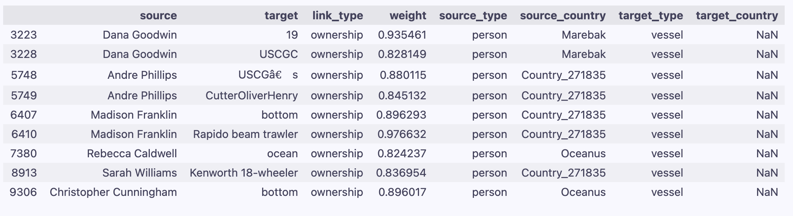
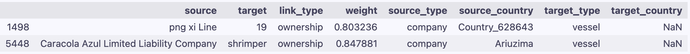
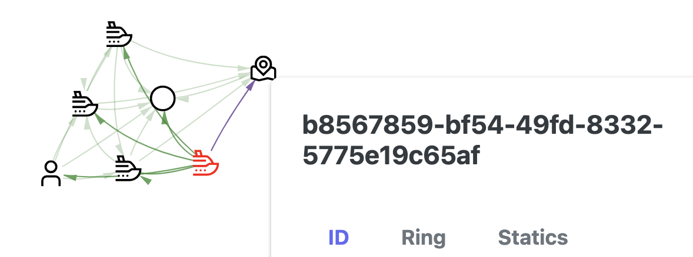
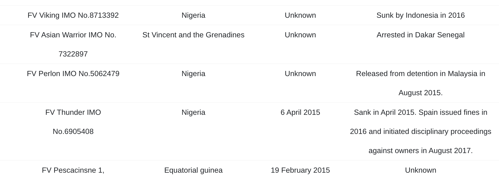
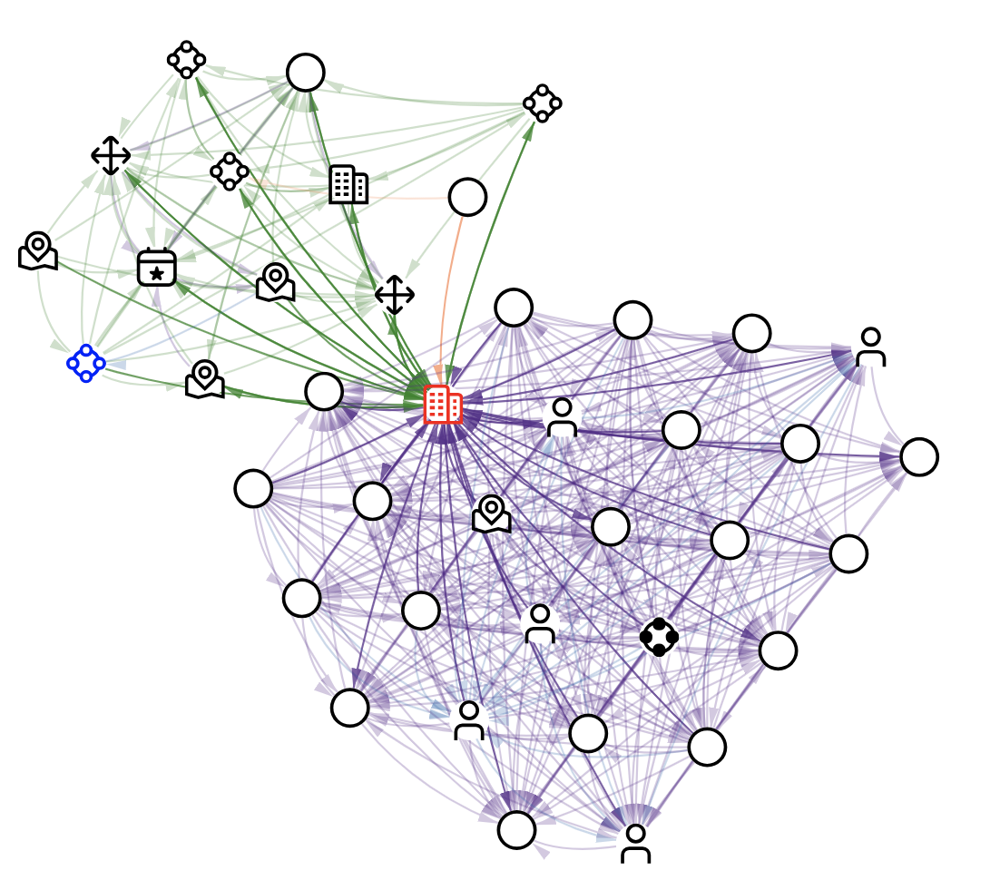

### 船连国家

115艘，30艘有指入的ownership，15艘可以找到

直接和人相连：

直接和公司相连：

二阶连公司：

Country_628643

png xi  Line-->7505050-->Leng 999 Gal

png xi  Line-->7505050-->Ships

多人多公司-->7505050-->HMS Montose

Nalakond

Spanish Shrimp Carriers-->160-->Oliver

二阶连人:

Country_470077

Christopher Fields-->Sonia Fisheries Pvt-->salmon

Country_358951

Monica Ramirez-->341411-->cutters

三阶连人：

Country_271835

Tracy Rogers -->55674-->21538-->Cutters 

多人情况：（斜体是船）

多人-->Ocean Fisheries Llc-->Leng 999 Gal

多人的国家情况：

| Country_271835 | Nalakond | Country_459036 | Country_542476 | Country_246944 |
| :------------: | :------: | :------------: | :------------: | :------------: |
|       7        |    1     |       1        |       1        |       1        |

### 可疑点直连边类型

|                     | 979893388 | 8327 | Mar de la Vida OJSC++ | Oceanfront Oasis Inc Carriers |
| ------------------- | --------- | ---- | --------------------- | ----------------------------- |
| family_relationship | 67        |      | 2                     | 2                             |
| membership          | 59        | 8    | 10                    | 1                             |
| partnership         | 45        | 2    | 4                     |                               |
| ownership           | 22        | 5    | 1                     | 1                             |

### 可疑点直连船

(8327,membership,water)  (8327,ownership,cutters)  (Coast,ownership,8327)

(979893388,partnership,ARA Contraalmirante Cordero)

## 一些可疑模式

就是会有一堆自己成强连通分量的，但是因为一两条边或一两个节点的连接而和最大的强连通分量（可疑点在的）有了连接

1. FV家族的船，通过b8location (FV和FV Thunder) 和Amanda Mckenzie (FV Thunder, FV Snake)连到了3388

   

一些场外信息（但也不能用就是）iuu vessel list

2. 同样也是一群partnership，通过Abigail Foster那个人和3388产生了联系

   其中的船叫Abrams MIA2和MBTs，event是Tank

   fyi：现实中这两个船的名字都是坦克的型号。。

   

3. 通过一个公司，一堆memebership和一堆partnership和3388联系上了

   公司叫Benton Ltd. Liability Co，政府组织704，ownership那两条的undefined是：American🤔

   那一坨绿的里面有一些还是有点复杂的，不只是纯这个partnership关系，但是ninety（movement），Pez Dorado BV Logistics（company）019d89a8-36be-4402-bf3c-d13cb982cf3f（location）比较纯

   

船和

person，

供应链

公司的membership，和organization，political organization直连

